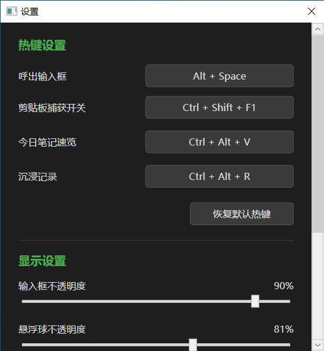
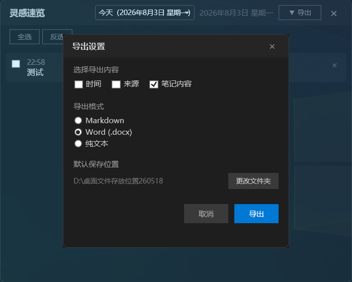
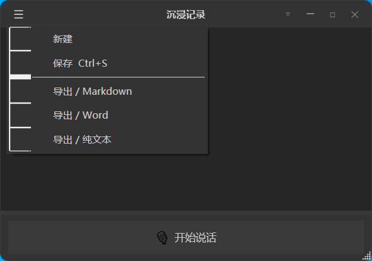

# 🎯 FocusCapture · 专注力捕捉

> 一个不打断你思路的灵感捕获器。悬浮球 + 剪贴板自动捕获 + 沉浸式语音输入 + 一键导出，所有数据只存在你自己的电脑上。

     

FocusCapture 是一款 Windows 桌面端灵感捕获工具：你在任何窗口随手复制一段话、按一个热键说一句话，它就把内容存进本地笔记库，不打断你手头的工作。之后可以按最近 3 天翻阅、导出成 Markdown / JSON / TXT / Word。

## 📸 预览

<table>
<tr>
<td align="center" width="33%"><br /><b>设置界面</b><br />所有热键与不透明度一手掌控</td>
<td align="center" width="33%"><br /><b>灵感速览</b><br />最近三天笔记 + 一键导出 Word/Markdown</td>
<td align="center" width="33%"><br /><b>沉浸记录</b><br />边说边记，全 C# 本地语音识别</td>
</tr>
</table>

---

## ✨ 功能特性

| 功能 | 说明 |
|------|------|
| 🖱️ **桌面悬浮球** | 常驻最前层，可调不透明度；输入、速览、设置、语音、退出五大入口一键直达 |
| 📋 **剪贴板自动捕获** | 复制即自动存为笔记；400ms 防抖过滤"选中即复制"类工具的瞬态写入；自动去重；可随时开关 |
| 🗣️ **沉浸式语音输入** | 纯 C# 本地语音识别（sherpa-onnx + FireRedASR2 CTC INT8），深/浅双主题、可置顶、正文占比可调，**离线可用、无需联网识别** |
| ⚡ **全局热键** | 不切窗口即可唤起输入 / 切换剪贴板捕获 / 打开速览 / 启动语音 |
| 📥 **灵感速览** | 最近 3 天笔记切换查看，支持长笔记折叠与回收站 |
| 📤 **一键导出** | Markdown / JSON / TXT / Word（.docx）四种格式；时间、来源窗口、标签、内容字段可勾选；自动处理重名 |
| 🏷️ **来源与标签** | 自动记录笔记来源窗口，支持打标签，导出时可选携带 |
| 🔒 **数据全本地** | 笔记、设置、模型全部存本机，不上传任何服务器 |

## 🎮 默认热键

| 热键 | 功能 |
|------|------|
| `Alt+Space` | 唤起灵感输入窗 |
| `Ctrl+Alt+F1` | 剪贴板自动捕获 开/关 |
| `Ctrl+Alt+V` | 打开/关闭 灵感速览 |
| `Ctrl+Alt+R` | 启动沉浸式语音输入 |
| `Ctrl+S` | 语音输入窗内保存 |

## 🚀 快速开始

### 方式一：直接下载（推荐）

到 [Releases](https://github.com/pengjie1115/FocusCapture/releases) 下载最新版 `FocusCapture.exe`（单文件绿色版，无需安装 .NET 运行时），双击即可运行。

### 方式二：从源码构建

```bash
git clone https://github.com/pengjie1115/FocusCapture.git
cd FocusCapture

# 需要 .NET 8 SDK
dotnet restore
dotnet publish -c Release -r win-x64 --self-contained true \
  -p:PublishSingleFile=true -p:IncludeNativeLibrariesForSelfExtract=true
```

产物在 `bin/Release/net8.0-windows/win-x64/publish/` 下，单文件 exe 可直接分发。

## 🗣️ 语音识别说明

- 引擎：**sherpa-onnx 1.13.4**（纯 C#，无 Python 依赖）+ **FireRedASR2 CTC INT8** 中英双语模型（约 740MB）+ Silero VAD
- 首次使用语音输入时，程序会自动从 `hf-mirror.com`（国内可直连）下载模型到本机，之后完全离线运行
- 模型文件存放在：`%LocalAppData%\FocusCapture\models\firered-asr2-ctc\`

## 📂 数据存储位置

| 内容 | 路径 |
|------|------|
| 笔记库 | `文档\FocusCapture\` |
| 配置文件 | `%AppData%\FocusCapture\settings.json` |
| 语音模型 | `%LocalAppData%\FocusCapture\models\` |
| 崩溃日志 | `%LocalAppData%\FocusCapture\startup-error.log` |

所有数据均在本机，卸载/删除目录即完全清除，不涉及任何云端同步。

## 🛠️ 技术栈

- **.NET 8** / **WPF**（+ WinForms 托盘图标）
- **sherpa-onnx 1.13.4** — 本地语音识别（FireRedASR2 CTC INT8 + Silero VAD）
- **NAudio 2.2.1** — 音频采集
- **System.Drawing.Common** — 托盘图标绘制
- 导出 .docx 为手写最小化 OOXML，零额外 NuGet 依赖

## 📁 项目结构

```
FocusCapture/
├── Models/            # 数据模型与设置（JSON 序列化）
├── Services/          # 核心服务：剪贴板监听/热键/笔记/导出/语音/回收站
├── Windows/           # 界面：悬浮球/输入窗/速览/设置/语音窗/导出对话框
├── MainWindow.xaml    # 主窗口（服务编排与生命周期）
└── FocusCapture.csproj
```

## 🗺️ Roadmap

- [x] 剪贴板自动捕获 + 防抖去重
- [x] 纯 C# 本地语音识别（替代 Python 子进程）
- [x] 灵感速览最近 3 天切换
- [ ] 笔记全文搜索
- [ ] 沉浸专注模式（计时 + 统计）
- [ ] 更多导出模板与自定义模板
- [ ] 标签管理与按标签筛选

> 有想法？欢迎在 [Issues](https://github.com/pengjie1115/FocusCapture/issues) 提 feature request，或直接提 PR。

## 🤝 参与贡献

欢迎任何形式的贡献：提 issue、改 bug、加功能、写文档、做宣传都可以。流程很简单：

1. Fork 本仓库
2. 创建你的功能分支（`git checkout -b feat/my-feature`）
3. 提交改动（遵循 [Conventional Commits](https://www.conventionalcommits.org/)）
4. 推送到你的 fork 并发起 Pull Request

详见 [CONTRIBUTING.md](CONTRIBUTING.md)。

## 📄 License

[MIT](LICENSE) © 2026 pengjie1115

---

**如果你觉得这个工具有用，点个 ⭐ Star 就是对我最大的支持！**
