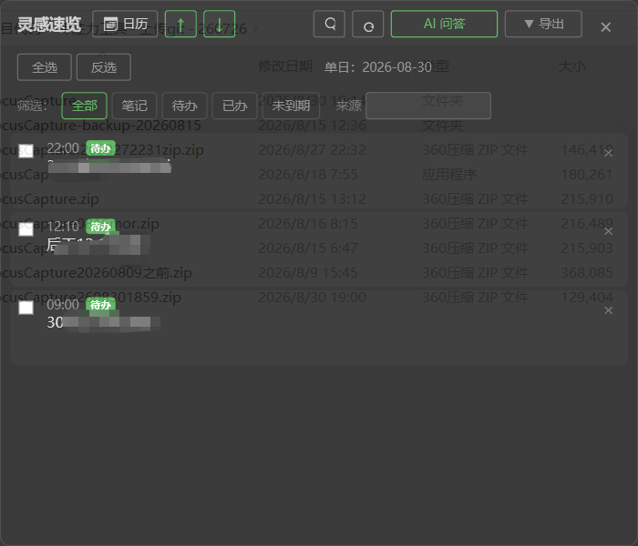
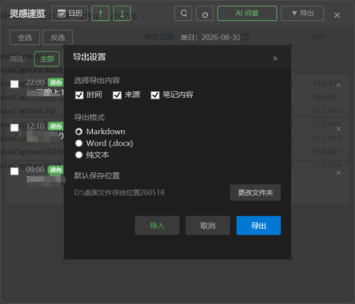
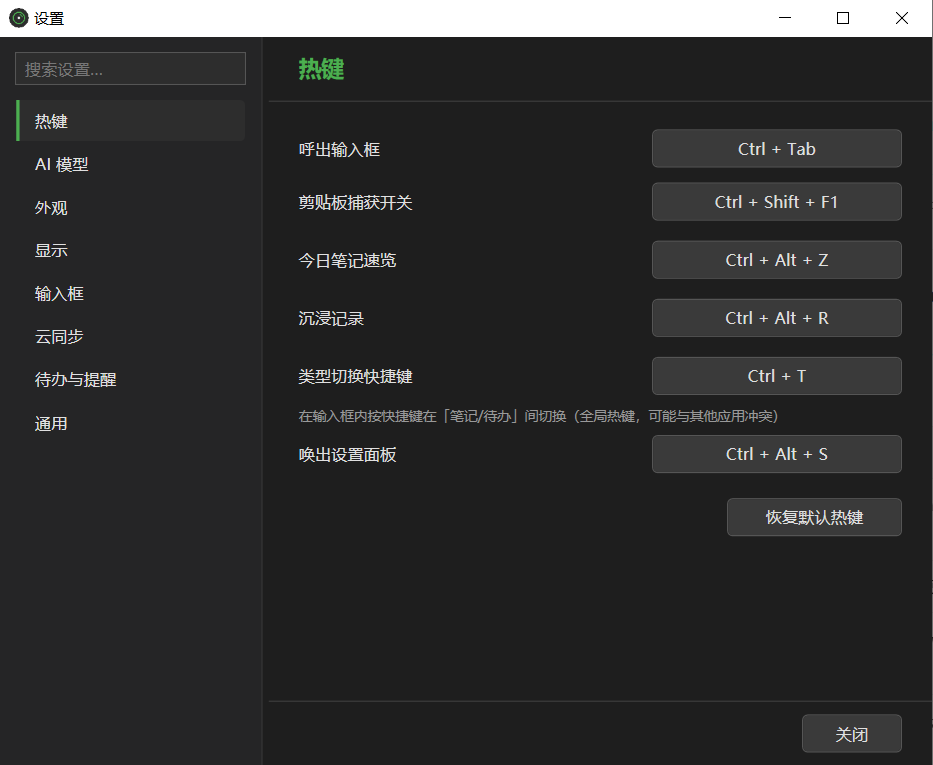
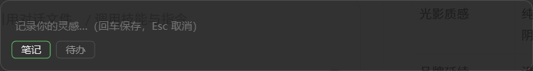

# 🎯 FocusCapture · 专注力捕捉

> 一个不打断你思路的灵感捕获器。悬浮球 + 剪贴板自动捕获 + 沉浸式语音输入 + AI 问答与整理 + 一键导出，所有数据只存在你自己的电脑上。

    

FocusCapture 是一款 Windows 桌面端灵感捕获工具：你在任何窗口随手复制一段话、按一个热键说一句话，它就把内容存进本地笔记库，不打断你手头的工作。之后可以按时间区间翻阅、查找、导出成 Markdown / JSON / TXT / Word，也可以交给 AI 问答与 AI 整理。

> **下载**：官网 <https://focuscapture.app.workbuddy.host/>（本仓库已转私有，GitHub Releases 仅自己可见）

## 📸 预览

<table>
<tr>
<td align="center" width="25%"><br /><b>灵感速览</b><br />区间筛选 + 一键导出 Word/Markdown</td>
<td align="center" width="25%"><br /><b>速览 · 增强</b><br />笔记导入 + 区间筛选 + 全局查找</td>
<td align="center" width="25%"><br /><b>设置面板</b><br />板块导航 + 全局搜索 + 深色主题</td>
<td align="center" width="25%"><br /><b>灵感输入</b><br />自动隐藏计时 + 记住拖动位置</td>
</tr>
</table>

---

## ✨ 功能特性

| 功能 | 说明 |
|------|------|
| 🖱️ **桌面悬浮球** | 常驻最前层，可调不透明度；输入、速览、设置、语音、退出五大入口一键直达 |
| 📋 **剪贴板自动捕获** | 复制即自动存为笔记；400ms 防抖过滤"选中即复制"类工具的瞬态写入；自动去重；可随时开关 |
| 🗣️ **沉浸式语音输入** | 纯 C# 本地语音识别（sherpa-onnx + FireRedASR2 CTC INT8），深/浅双主题、可置顶、正文占比可调，**离线可用、无需联网识别** |
| ⚡ **全局热键** | 不切窗口即可唤起输入 / 切换剪贴板捕获 / 打开速览 / 启动语音 / 唤起 AI 问答 / 待办汇总 / 设置面板，键位可自定义 |
| 📥 **灵感速览** | 区间筛选（今天 / 昨天 / 近 7 天 / 近 30 天 / 自定义）；标题栏功能按钮可自由组装；窗口可最小化 / 最大化 / 边缘自由缩放；日历绿点标笔记数、橙点标待办；长笔记折叠与回收站 |
| ✅ **待办与提醒** | 一句话记待办，自动解析到期时间；待办汇总面板；未到期待办在日历上有标注，到期弹提醒 |
| 💬 **AI 问答** | 图文混排：Ctrl+V 粘贴截图、拖入 Word / Markdown / PDF 自动抽正文；会话侧边栏与分组管理；历史消息全局搜索（命中处逐词高亮）；起手页快捷问法；界面明暗两极可调 |
| ✨ **AI 整理** | 一大段乱文字一键理成条理清楚的内容（保原意、分点、加小标题、去重、改错别字）；**先出「原文 ↔ 结果」对照预览**，看清了再选替换原文 / 另存为新笔记 / 复制；预置 4 条规则 + 可自定义；能从记录里提取待办并建成真待办 |
| 🤖 **AI 模型多供应商** | 同时接入多家 OpenAI 兼容服务，每家独立保存地址与密钥、各自带一组模型；可指定默认模型与整理专用模型；API Key 只存本机 |
| 🧰 **Agent 工具 / Skill 扩展** | AI 可查笔记、列待办、记灵感、推送云端（写操作可要求对话内确认）；可装第三方技能，内置技能随应用分发 |
| 📤 **一键导出** | Markdown / JSON / TXT / Word（.docx）四种格式；时间、来源窗口、标签、内容字段可勾选；自动处理重名 |
| 🏷️ **来源与标签** | 自动记录笔记来源窗口，支持打标签，导出时可选携带 |
| ☁️ **加密云同步（可选）** | WebDAV（如坚果云）或百度网盘；AES-256-GCM 端到端加密，授权码即钥匙；附件按需上传、本地副本可设自动释放；「与云端核对」只读比对网盘实际文件。默认不同步 |
| 🔒 **数据全本地** | 笔记、设置、模型、AI 问答附件全部存本机，不上传任何服务器 |

## 🎮 默认热键

| 热键 | 功能 |
|------|------|
| `Alt+Space` | 唤起灵感输入窗 |
| `Ctrl+Alt+F1` | 剪贴板自动捕获 开/关 |
| `Ctrl+Alt+V` | 打开/关闭 灵感速览 |
| `Ctrl+Alt+R` | 启动沉浸式语音输入 |
| `Ctrl+Alt+A` | 唤起 AI 问答 |
| `Ctrl+Alt+T` | 打开/收起 待办汇总面板 |
| `Ctrl+Alt+S` | 唤出设置面板 |
| `Ctrl+T` | 在输入框内切换「笔记 / 待办」 |
| `Ctrl+S` | 语音输入窗内保存 |

## 🚀 快速开始

### 方式一：直接下载（推荐）

到官网 <https://focuscapture.app.workbuddy.host/> 下载最新版 `FocusCapture.exe`（单文件绿色版，约 249 MB，无需安装 .NET 运行时），双击即可运行。

### 方式二：从源码构建

```bash
git clone https://github.com/pengjie1115/FocusCapture.git
cd FocusCapture

# 需要 .NET 8 SDK
dotnet restore
dotnet publish -c Release -r win-x64 --self-contained true \
  -p:PublishSingleFile=true -p:IncludeNativeLibrariesForSelfExtract=true
```

产物在 `bin/Release/net8.0-windows/win-x64/publish/` 下，单文件 exe 可直接分发。

改完代码建议先跑一遍自动化检查点：

```bash
tools\dev.ps1 build     # 编译（自带环境变量补丁）
tools\dev.ps1 test      # 快层 148 条：加密 / 时间解析 / AI 解析 / 模型清单解析等（纯逻辑，秒级）
tools\dev.ps1 test -Slow  # 慢层 740 条：双向同步 / 分组 / 搜索 / 主题 / 技能执行（约 170 秒）
tools\dev.ps1 ready     # 交付前自检：编译 + 全量检查点 + 文档条数核对
```

也可直接双击 `tests\run-tests.bat` / `tests\sync\run-sync-tests.bat`。退出码 `0` = 通过，`1` = 有失败。检查点跑在临时沙箱中，不会触碰你的真实数据。规则见 [`REGRESSION.md`](REGRESSION.md) 第二节。

## 🗣️ 语音识别说明

- 引擎：**sherpa-onnx 1.13.4**（纯 C#，无 Python 依赖）+ **FireRedASR2 CTC INT8** 中英双语模型（约 740MB）+ Silero VAD
- 首次使用语音输入时，程序会自动从 `hf-mirror.com`（国内可直连）下载模型到本机，之后完全离线运行
- 模型文件存放在：`%LocalAppData%\FocusCapture\models\firered-asr2-ctc\`

## 📂 数据存储位置

| 内容 | 路径 |
|------|------|
| 笔记库 | `文档\FocusCapture\` |
| AI 问答会话与附件 | `文档\FocusCapture\chat_history\`（附件按内容哈希去重，只存本机、不进同步） |
| 配置文件 | `%AppData%\FocusCapture\settings.json` |
| 语音模型 | `%LocalAppData%\FocusCapture\models\` |
| 崩溃日志 | `%LocalAppData%\FocusCapture\startup-error.log` |

所有数据均在本机；云同步默认关闭，开启后也只存你自己的网盘（端到端加密）。

## 🛠️ 技术栈

- **.NET 8** / **WPF**（+ WinForms 托盘图标）
- **sherpa-onnx 1.13.4** — 本地语音识别（FireRedASR2 CTC INT8 + Silero VAD）
- **NAudio 2.2.1** — 音频采集
- **PdfPig 0.1.8** — PDF 文本抽取（纯托管，无需用户侧联网）
- **System.Drawing.Common** — 托盘图标绘制
- 导出 .docx 为手写最小化 OOXML，零额外 NuGet 依赖

## 📁 项目结构

```
FocusCapture/
├── Models/            # 数据模型与设置（JSON 序列化）
├── Services/          # 核心服务：剪贴板监听/热键/笔记/导出/语音/回收站/云同步/AI/技能
├── Windows/           # 界面：悬浮球/输入窗/速览/设置/语音窗/AI 问答/导出对话框
├── website/           # 官网（纯静态多页站，维护规则见 website/AGENTS.md）
├── docs/              # 设计稿、调研与评估文档、界面截图
├── tests/             # 自动化检查点：快层 148 条 + 慢层 740 条
├── tools/             # dev.ps1 脚本入口与诊断探针
├── MainWindow.xaml    # 主窗口（服务编排与生命周期）
└── FocusCapture.csproj
```

## 🗺️ Roadmap

- [x] 剪贴板自动捕获 + 防抖去重
- [x] 纯 C# 本地语音识别（替代 Python 子进程）
- [x] 灵感速览区间筛选与日历标注
- [x] AI 问答（图文混排 / 会话分组 / 全局搜索）
- [x] AI 整理（规则化 + 对照预览）
- [x] AI 模型多供应商
- [ ] 沉浸专注模式（计时 + 统计）
- [ ] 更多导出模板与自定义模板
- [ ] 标签管理与按标签筛选

## 🤝 反馈与贡献

本仓库当前为**私有仓库**，暂不接受外部 Issue / PR。反馈问题或提建议请发邮件到 **3097199704@qq.com**（写清现象、复现步骤与系统版本）。

项目内部约定见 [AGENTS.md](AGENTS.md)。

## 📄 License

[MIT](LICENSE) © 2026 pengjie1115
